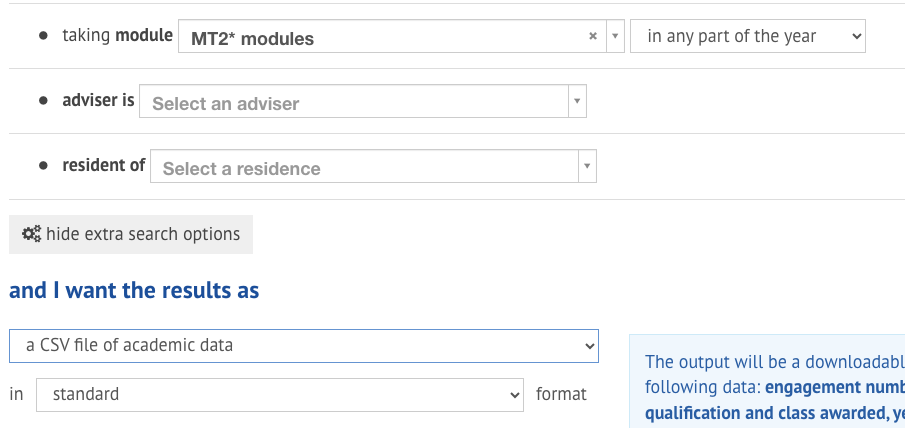

# StA_Advising
This repository provides a tool to help with Honours advising in the School of Mathematics and Statistics at the University of St Andrews.

# Usage
The tool operates from command line. Currently it can process single Honours Choice forms from individual students, or a folder containing multiple such forms. To use the script on a honours choice form, navigate to the folder where `advising_tool.py` is saved and type

```
python advising_tool.py form_file.xlsx
```

If you wish to process a folder of form files, simply replace the `form_file.xlsx` with the folder name.

# Installation and file setup
Installation of this tool requires three steps: (i) installing python dependencies, (ii) Downloading the code from this repository and (iii) Donwloading student data files from MMS

## Installing python 
If you don't have python installed on your computer, I recommend installing anaconda (https://www.anaconda.com/). Once python is installed, you need to install a small number of python packages by typing

```
pip install openpyxl
pip install pandas
pip install termcolor
```

## Getting the code
You'll find options for downloading the code by clicking on the green button 'Code' on the top right. For example, if you have ssh access setup in your github user account, you could navigate to the folder you'll want to use and type

```
git clone git@github.com:kursawe/StA_Advising.git
```

Downloading a .zip file and extracting it is also an option. 

## Accessing student data files

To access student module data navigate to the website

https://www.st-andrews.ac.uk/studentrecords/

then click on 'Show extra search options'. This will open up new options to select catagories for students whose files we would like to access. In the section 'taking module' select 'MT2* modules'. Then, under 'and I want the results as' select 'a CSV file of academic data' in 'standard' format. Save the file in the subfolder student_data, which is part of the repository file structure. Repeat the process three times by selecting 'MT3* modules', 'MT4* modules' and also 'MT5* modules'.

This should look something like this:



# Background info and functionality


# Troubleshooting and known issues
